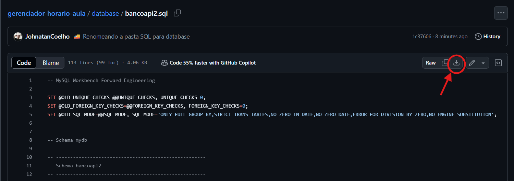
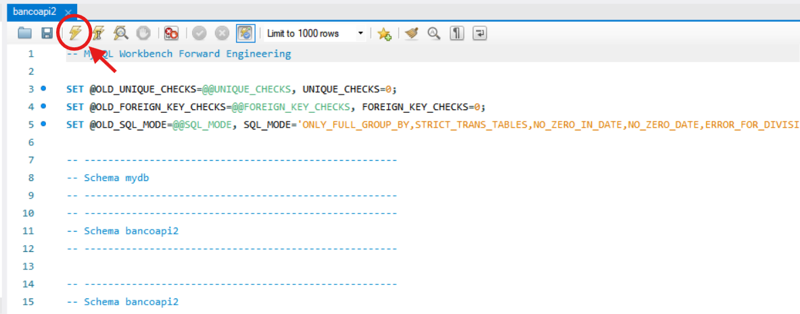
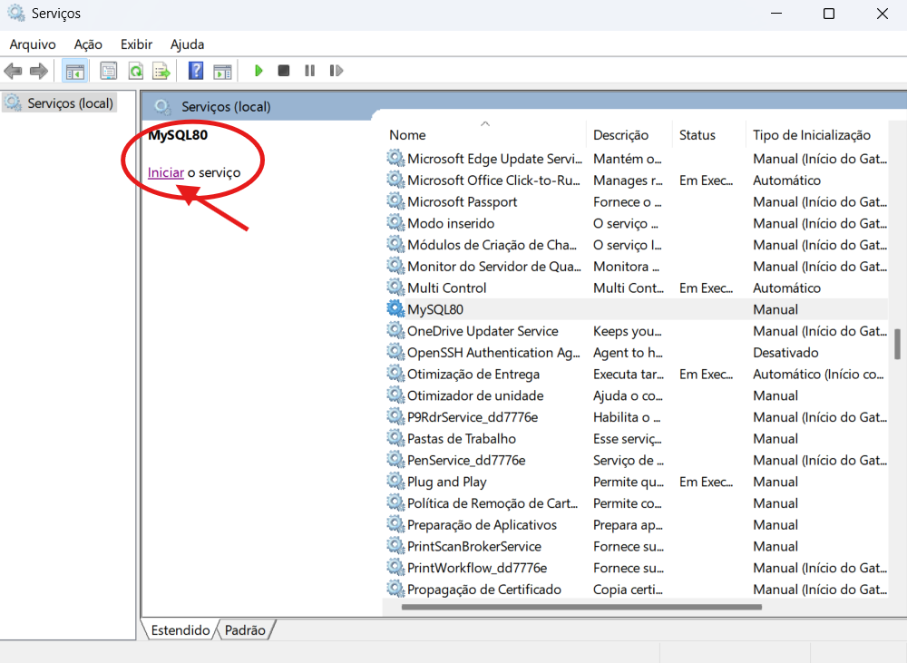

<html>
<head><meta charset="UTF-8">
    <meta name="viewport" content="width=device-width, initial-scale=1.0"> </head>

<body>

## índice de instalação
‣ [Introdução](#1---introdução) 
‣ [Requisitos para o funcionamento](#2---requisitos-para-o-funcionamento) 
‣ [Preparação e Download](#3---preparação-e-download) 
‣ [Configuração Inicial](#4---configuração-inicial) 
‣ [Problemas Possíveis](#5---problemas-possíveis) 
‣ [Suporte Cliente](#6---suporte)

### 1 - Introdução

***Sobre o sistema:*** Sistema de gerenciador de horários, consiste em uma aplicação desktop que permite os coordenadores definir e atribuir horários para seus determinados cursos.

***Versão da aplicação:*** 1.0

### 2 - Requisitos para o Funcionamento

- ***Sistema operacional:*** 10 ou superior.
- ***Memória RAM:*** 4 GB
- ***Espaço Disco Rígido:*** 60 MB
- ***MySQL:*** Versão 8.0.42 CE

### 3 - Preparação e Download

####  Download
 - Acesse a pasta Aplication para o download do aplicativo: [Sistema de Gerenciamento de Horário](https://github.com/vp-p/gerenciador-horario-aula/tree/main/Aplication)
 

#### Preparação do sistema

- Verifique o MySQL Workbench, o banco de dados da aplicação estão instalados. 

 - Caso não estejam, segue o link para instalação: 

    - **MySQL:** [MySQL Workbench 8.0.42](https://dev.mysql.com/downloads/workbench/)

    - **Banco de Dados:** [BD_Gerenciador_Horario](https://github.com/vp-p/gerenciador-horario-aula/blob/main/database/bancoapi2.sql)

    

### 4 - Configuração inicial

#### 1 - Configurando o banco de dados

- Abra o arquivo **BD_Gerenciador_Horario** que você instalou, insira a senha snp-007 para extrair o arquivo.
- Abra o arquivo no MySQL Workbench.
- Execute em sua máquina para obter toda estrutura do banco, como mostrado a seguir: 

#### 2 - Arquivo Executável

 - Após a criação do banco de dados, acesse a plataforma através do arquivo executável JAR. 

 ### 5 - Problemas Possíveis

 #### Problema com o acesso ao banco de dados
 - Verifique no Windows em área de serviços, se o MySQL está em execução.
 - Caso em execução, clique em cima do serviço 'MySQL' e em 'Iniciar o serviço'

  
 

#### Problemas de execução do arquivo executável

- Verifique se todo o processo de instalação foi atendido. Caso o problema persistir entre em contato com o suporte sinapse.

### 6 - Suporte
***Equipe suporte:*** Sinapse

***E-mail:*** sinapseTeam@gmail.com

</body>
</html>
