<html>
<head><meta charset="UTF-8">
    <meta name="viewport" content="width=device-width, initial-scale=1.0"> </head>

<body>

## índice

#### Tela Principal

 > Nessa tela será mostrada todas as funcionalidades da grade horária.

‣ [Tela Principal](#tela-principal) 
‣ [Funcionalidades](#funcionalidades-da-tela) 
‣ [Cadastro de Aulas](#cadastrar-nova-aula) 
‣ [Filtros](#filtros)

#### Tela Professor

> A partir deste momento é crucial, seguir o passo a passo, para que haja eficiência na inserção de disciplinas dentro da Grade Horária.

‣ [Tela Professor](#tela-professor)

<strong>Tela Principal</strong>

## Tela Principal

Ao abrir a aplicação, vai ser apresentada tela "Grade Horária", sendo possível definir os horários para as disciplinas de determinados cursos.

 Veja a imagem a seguir: 

 

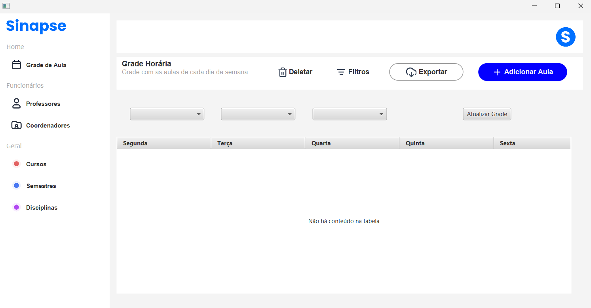

### Funcionalidades da Tela

### Cadastrar nova aula

**1 - Clique no botão "Adicionar Aula", como mostrado na imagem a seguir:**
 

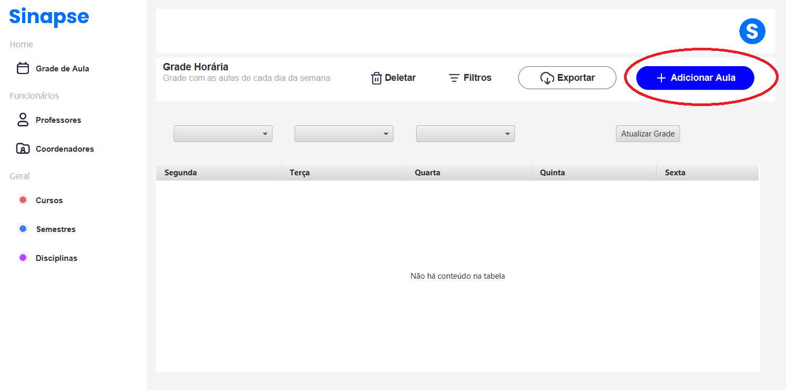

 

 **2 - Abrirá uma nova tela, na qual você deve definir o curso, disciplina, dia da semana e horário.**

 

 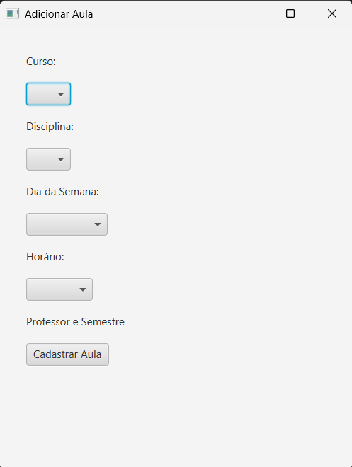

 

 **3 - Logo após, preencher os campos, clique no botão "Cadastrar Aula"**

 

 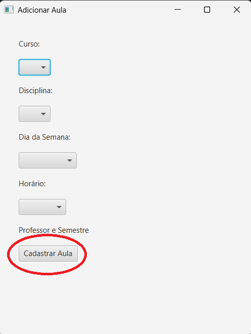

***OBSERVAÇÃO:*** **Caso os campos não sejam preenchidos e o botão "Cadastrar Aula" seja acionado,  uma tela de alerta será exibida.**

 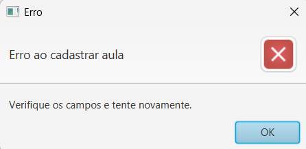

 

**4 - As aulas cadastradas serão exibidas dentro da tabela principal.**

 

 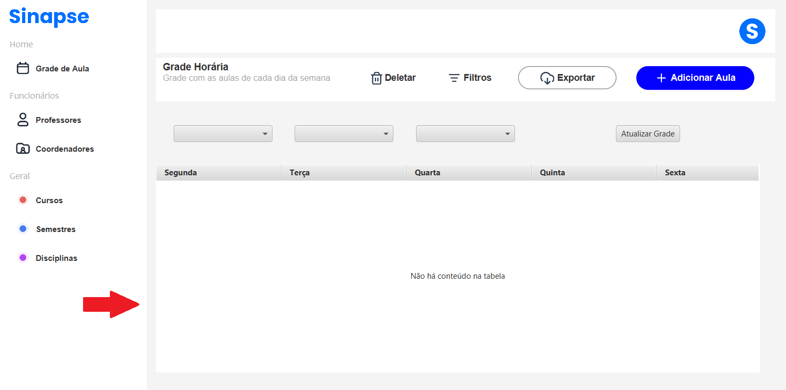

### Filtros 

 **1 - Caso queira adicionar filtros a tabela, existem alguns botões que possibilitam essa função.**

   

  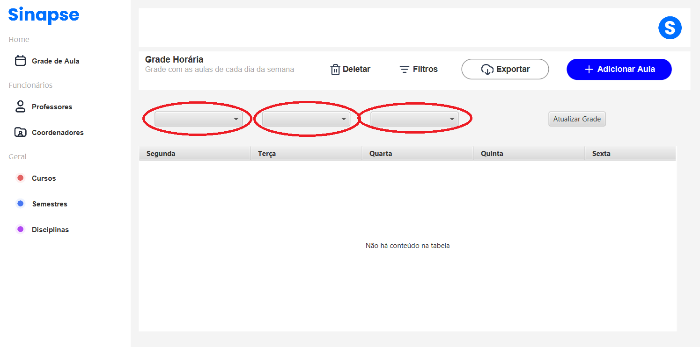

  ***OBSERVAÇÃO:*** **Necessário que todos os filtros estejam preenchidos para que aplicação funcione.**

<strong>Tela Professor</strong>

## Tela Professor

- Para se direcionar a tela do professor, selecione no menu a opção "professores".

Veja a imagem a seguir:

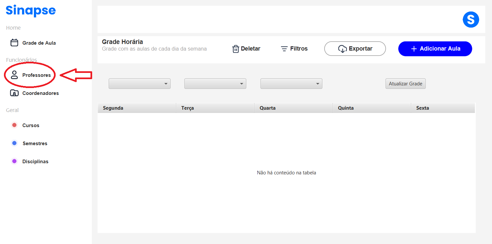

- ***Abrirá em seu computador a seguinte tela:***

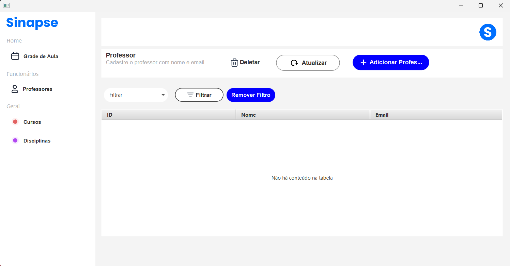

### Funcionalidades da tela:

### Cadastrar Professor

***1 - Clique em "Adicionar professor"***

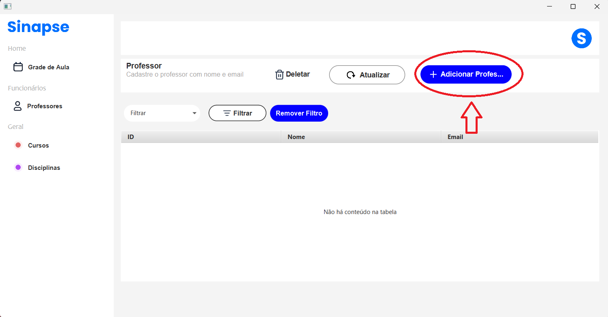 

***2 - Preencha os campos "Nome" e "Email". Após Clique em "Cadastrar"***

 

### Deletar Professor

***1 - Selecione a linha que está o professor que desejas deletar***
***2 - Clique em "Deletar"***

 

***OBSERVAÇÃO:*** Sempre selecione a linha, caso contrário mostrará um erro. Veja a imagem a seguir:

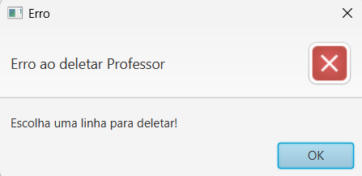 

***3 - Confirme sobre sua decisão***

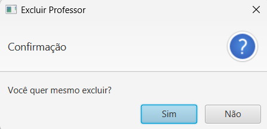 

 

</body>
</html>
