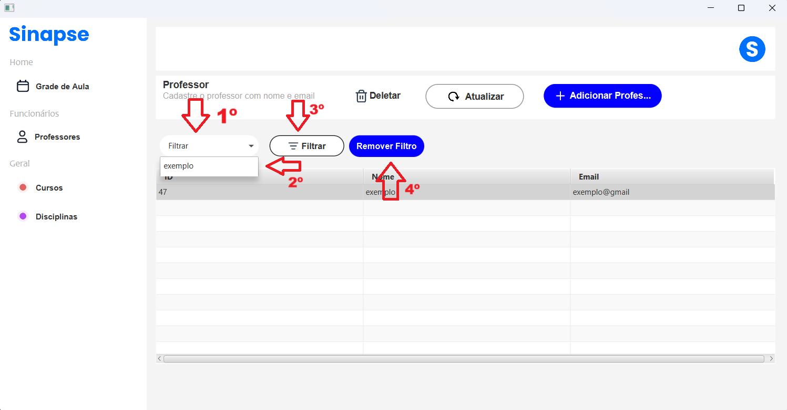
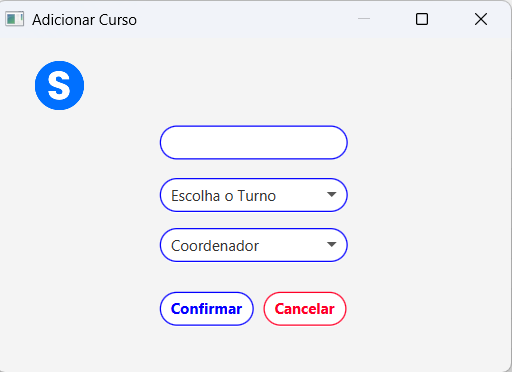

<html>
<head><meta charset="UTF-8">
    <meta name="viewport" content="width=device-width, initial-scale=1.0"> </head>

<body>

## Tela Principal

 > Nessa tela será mostrada todas as funcionalidades da grade horária.

<strong>Tela Grade Horária</strong>

## Tela Principal

Ao abrir a aplicação, vai ser apresentada tela "Grade Horária", sendo possível definir os horários para as disciplinas de determinados cursos.

 Veja a imagem a seguir: 

 

### Funcionalidades da Tela

### Cadastrar nova aula

**1 - Clique no botão "Adicionar Aula", como mostrado na imagem a seguir:**
 

 

 **2 - Abrirá uma nova tela, na qual você deve definir o curso, disciplina, dia da semana e horário.**

 

 

 

 **3 - Logo após, preencher os campos, clique no botão "Cadastrar Aula"**

 

 

***OBSERVAÇÃO:*** **Caso os campos não sejam preenchidos e o botão "Cadastrar Aula" seja acionado,  uma tela de alerta será exibida.**

 

 

**4 - As aulas cadastradas serão exibidas dentro da tabela principal.**

 

 

### Filtros 

 **1 - Caso queira adicionar filtros a tabela, existem alguns botões que possibilitam essa função.**

   

  

  ***OBSERVAÇÃO:*** **Necessário que todos os filtros estejam preenchidos para que aplicação funcione.**

## Telas 

> A partir deste momento é crucial, seguir o passo a passo, para que haja eficiência na inserção de disciplinas dentro da Grade Horária.

<strong>Tela Professor</strong>

## Tela Professor

- Para se direcionar a tela do professor, selecione no menu a opção "Professores".

Veja a imagem a seguir:

- ***Abrirá em seu computador a seguinte tela:***

### Funcionalidades da tela:

### Cadastrar Professor

***1 - Clique em "Adicionar professor"***

 

***2 - Preencha os campos "Nome" e "Email". Após Clique em "Cadastrar"***

 

### Deletar Professor

***1 - Selecione a linha que está o professor que desejas deletar***

***2 - Clique em "Deletar"***

 

***OBSERVAÇÃO:*** Sempre selecione a linha, caso contrário mostrará um erro. Veja a imagem a seguir:

 

***3 - Confirme sobre sua decisão***

 

### Atualiizar Professor

***1 - Selecione a linha que está o professor que desejas atualiizar***

***2 - Clique em "Atualizar"***

 

***OBSERVAÇÃO:*** Sempre selecione a linha, caso contrário mostrará um erro. Veja a imagem a seguir:

 

***3 - Logo após abrirá uma nova janela, preencha os campos e clique em "Atualizar"***

 

### Filtrar Tabela

***1 - Clique em Filtro***

***2 - Selecione o nome que desejas filtrar***

***3 - Clique em "Filtrar"***

***4 - Quer finalizar a filtragem, clique em "Remover Filtro"***

 

<strong>Tela Curso</strong>

## Tela Curso

- Para se direcionar a tela de curso, selecione no menu a opção "Cursos".

Veja a imagem a seguir:

- ***Abrirá em seu computador a seguinte tela:***

### Funcionalidades da tela:

### Cadastrar Curso

***1 - Clique em "Adicionar Cursos"***

 

***2 - Preencha os campos e logo após Clique em "Confirmar"***

 

### Deletar Curso

***1 - Selecione a linha que está o curso que desejas deletar***

***2 - Clique em "Deletar"***

 

***OBSERVAÇÃO:*** Sempre selecione a linha, caso contrário mostrará um erro. Veja a imagem a seguir:

 

***3 - Confirme sobre sua decisão***

 

### Filtrar Tabela

***1 - Clique em Filtro***

***2 - Clique em "Escolha o coordenador"***

***3 - Selecione o coordenador que desejas filtrar***

***4 - Quer finalizar a filtragem, clique em "Limpar"***

 

<strong>Tela Disciplina</strong>

## Tela Disciplina

- Para se direcionar a tela de disciplina, selecione no menu a opção "Disciplinas".

Veja a imagem a seguir:

- ***Abrirá em seu computador a seguinte tela:***

### Funcionalidades da tela:

### Cadastrar Disciplina

***1 - Clique em "Adicionar Disciplinas"***

 

***2 - Preencha os campos e logo após Clique em "Cadastrar"***

 

### Deletar Curso

***1 - Selecione a linha que está a diciplina que desejas deletar***

***2 - Clique em "Deletar"***

 

***OBSERVAÇÃO:*** Sempre selecione a linha, caso contrário mostrará um erro. Veja a imagem a seguir:

 

***3 - Confirme sobre sua decisão***

 

### Atualizar Disciplina

***1 - Selecione a linha que está a disciplina que desejas atualiizar***

***2 - Clique em "Atualizar"***

 

***OBSERVAÇÃO:*** Sempre selecione a linha, caso contrário mostrará um erro. Veja a imagem a seguir:

 

***3 - Logo após abrirá uma nova janela, preencha os campos e clique em "Atualizar"***

### Filtrar Tabela

***1 - Clique em Filtro***

***2 - Selecione o nome que desejas filtrar***

***3 - Clique em "Filtrar"***

***4 - Quer finalizar a filtragem, clique em "Remover Filtro"***

 

 

</body>
</html>
