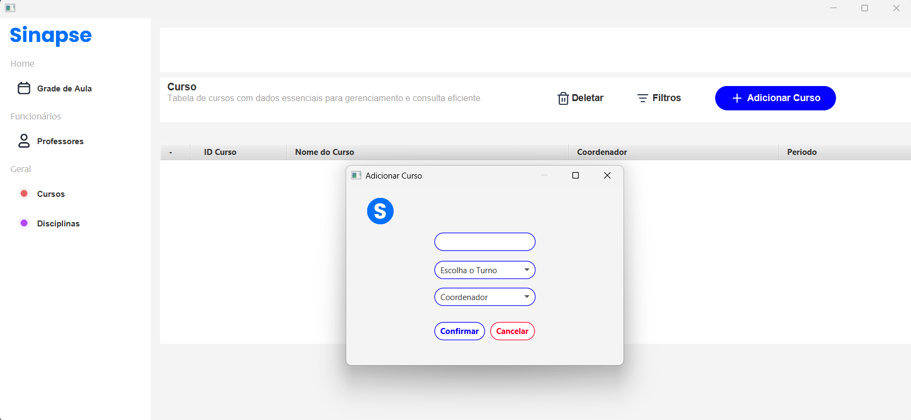

<html>
<head><meta charset="UTF-8">
    <meta name="viewport" content="width=device-width, initial-scale=1.0"> </head>

<body>

 

# Planejamento de Sprints

<strong>Sprint 1</strong>

## User Stories

| Rank | Prioridade | ID   | User Story    | Story Points | Sprint | Requisitos do Parceiro |
|------|------------|----------|-------------------------------------------------------------------------------------------------------|--------------|--------|-------|
| 1    |  ALTA | SIN - 6  | Como coordenador, quero visualizar a grade de aulas com horários em tabela, para possibilitar a fácil identificação e distribuição de disciplinas e horários. | 3            | 1      | 8 |

### Requisitos:

- A aplicação deve conter a grade horária das aulas em uma tabela para melhor identificação e distruibuição de disciplina;
- Os dados na tabela devem conter apenas os professores, as disciplinas e os horários de um determinado curso.

### Definition of Done (DoD):
 - Código da aplicação devidamente versionado, organizado, funcionando e disponibilizado no Git Hub.
 - Gerenciamento da equipe definido e implementado na criação de telas.
 - Funcionalidade revisada por pelo menos um membro da equipe (Code Rewiew). 
 - Funcionalidade testada e aprovada.
 - Funcionalidade integrada ao Sistema.

 ### Definition of Ready (DoR):
- User Story priorizada e apta para ser desenvolvida.
- User Story atende aos critérios de aceitação.
- Tarefas definidas, atribuidas e relacionadas com as User Stories.
- Na grade de aulas, será possível visualizar aulas dividas em campos da tabela.

### WireFrame

 

<strong>Sprint 2</strong>

## User Stories

| Rank | Prioridade | ID   | User Story    | Story Points | Sprint | Requisitos do Parceiro|
|------|------------|------|---------------|--------------|--------|-----------------------|
|2     | ALTA | SIN - 7 | Como coordenador, quero cadastrar professores para consultar seus dados rapidamente, facilitando alocação de turmas. | 3 | 2 | 8 |

### Requisitos:

- O coordernador deve ter a funcionalidade de cadastrar o professor com as informações Nome e Email.
- Para a consulta, deve ser feita em tabelas para melhor visualização.
- O coordenador deve ter a funcionalidade de excluir informações de professores enviadas indevidamente.

### Definition of Done (DoD):

 - Código da aplicação devidamente versionado, organizado, funcionando e disponibilizado no Git Hub.
 - Gerenciamento da equipe definido e implementado na criação de telas.
 - Funcionalidade revisada por pelo menos um membro da equipe (Code Rewiew). 
 - Funcionalidade testada e aprovada.
 - Funcionalidade integrada ao Sistema.

 ### Definition of Ready (DoR):

- User Story priorizada e apta para ser desenvolvida.
- User Story atende aos critérios de aceitação.
- Tarefas definidas, atribuidas e relacionadas com as User Stories.
- No cadastro do professor, teremos campos para inserção do nome e email de cada professor.

### WireFrame:

 

---

 

| Rank | Prioridade | ID  | User Story | Story Points | Sprint | Requisitos do Parceiro|
|------|------------|-----|------------|--------------|--------|-----------------------|
| 3    |  ALTA | SIN - 8  | Como coordenador, quero cadastrar aulas no sistema para evitar choques de horários.                   | 5           | 2      | 8 | 

### Requisitos:

- Ao cadastrar novas aulas, o mesmo professor não pode estar em várias aulas ao mesmo tempo.
- O mesmo professor leciona no máximo 10 aulas em um dia, portanto deve ter 11 horas de descanso apartir da última aula lecionada.
- Deve haver uma sugestão de alocação de horário, caso haja duplicidade do mesmo professor em um mesmo horário em várias aulas.
- Todas as aulas precisam ter 50 minutos.

### Definition of Done (DoD):

 - Código da aplicação devidamente versionado, organizado, funcionando e disponibilizado no Git Hub.
 - Gerenciamento da equipe definido e implementado na criação de telas.
 - Funcionalidade revisada por pelo menos um membro da equipe (Code Rewiew). 
 - Funcionalidade testada e aprovada.
 - Funcionalidade integrada ao Sistema.

 ### Definition of Ready (DoR):

- User Story priorizada e apta para ser desenvolvida.
- User Story atende aos critérios de aceitação.
- Tarefas definidas, atribuidas e relacionadas com as User Stories.
- Será possível adicionar uma nova aula com informações de inicio do horário, fim do horário e dia da semana.
- Em uma aula, o coordenador irá inserir dados relacionados sobre o professor, disciplina, curso e horário. 

### Wireframe:

 

### Validações: 

| 
Validações 
| 
Retorno do Cliente
 |
|------------------------------|-------------------------------------|
| O registro do intervalo entra como uma aula? Que teria o tempo reduzido?| Toda aula precisa ter 50 minutos. |
| Os horários já definidos, posteriormente tem previsão de troca de horários dos professores ou é fixo? | O horário não troca durante o semestre |

 

---

 

| Rank | Prioridade | ID       | User Story | Story Points | Sprint | Requisitos do Parceiro |
|------|----------------------------------------------------------------------|----------|------------------|--------------|--------|--------|
| 4    |  ALTA | SIN - 9  | Como coordenador, quero cadastrar cursos para garantir que todas as disciplinas estejam vinculadas a uma estrutura curricular específica. | 3            | 2      | 4 |

### Requisitos: 

- O coordenador deve poder criar os cursos informando o nome e o periodo.
- O coordenador deve poder excluir dados do curso enviados indevidamente.

### Definition of Done (DoD):

 - Código da aplicação devidamente versionado, organizado, funcionando e disponibilizado no Git Hub.
 - Gerenciamento da equipe definido e implementado na criação de telas.
 - Funcionalidade revisada por pelo menos um membro da equipe (Code Rewiew). 
 - Funcionalidade testada e aprovada.
 - Funcionalidade integrada ao Sistema.

 ### Definition of Ready (DoR):

- User Story priorizada e apta para ser desenvolvida.
- User Story atende aos critérios de aceitação.
- Tarefas definidas, atribuidas e relacionadas com as User Stories.
- No gerenciamento de curso, possibilita o coordenador a criar e remover curso. Deve-se informar o nome e o período.

### WireFrame:

 

---

 

| Rank | Prioridade | ID       | User Story | Story Points | Sprint | Requisitos do Parceiro |
|------|----------------------------------------------------------------------|----------|------------------|--------------|--------|--------|
| 5    |  ALTA | SIN - 10 | Como coordenador, quero cadastrar disciplinas no sistema para facilitar a alocação eficiente de professores. | 3            | 2      | 6 |

### Requisitos: 

- O coordenador deve poder criar disciplinas informando o nome, curso e o semestre.
- O coordenador deve poder excluir os dados das disciplinas enviadas indevidamente.

### Definition of Done (DoD):

 - Código da aplicação devidamente versionado, organizado, funcionando e disponibilizado no Git Hub.
 - Gerenciamento da equipe definido e implementado na criação de telas.
 - Funcionalidade revisada por pelo menos um membro da equipe (Code Rewiew). 
 - Funcionalidade testada e aprovada.
 - Funcionalidade integrada ao Sistema.

 ### Definition of Ready (DoR):

- User Story priorizada e apta para ser desenvolvida.
- User Story atende aos critérios de aceitação.
- Tarefas definidas, atribuidas e relacionadas com as User Stories.
- No gerenciamento da disciplina, possibilita o coordenador a criar e remover a disciplina. Deve-se informar o nome da disciplina, o curso e o semestre.

### WireFrame:

 

### Validações: 

| 
Validações 
| 
Retorno do Cliente
 |
|------------------------------|-------------------------------------|
| Gerenciamento de semestre letivo,  permitindo definir quais disciplinas fazem parte do semestre de um determinado curso tem limite de materiais no semestre? Qual seria o limite? | Não tem limite de disciplinas, mas tem o limite de 24 horas por semana. |

 

---

 

| Rank | Prioridade | ID       | User Story | Story Points | Sprint | Requisitos do Parceiro |
|------|----------------------------------------------------------------------|----------|------------------|--------------|--------|--------|
| 6    |  ALTA | SIN - 11 | Como coordenador, quero cadastrar coordenadores para cada curso para que o curso funcione de forma eficiente, alinhado aos objetivos institucionais e às normas educacionais. | 3            | 2      | 3 |

### Requisitos: 

- O coordenador deve poder adicionar novos coordenadores, indicando seu nome, email, senha e curso.
- O coordenador deve poder excluir os dados dos coordenadores enviadas indevidamente.

### Definition of Done (DoD):

 - Código da aplicação devidamente versionado, organizado, funcionando e disponibilizado no Git Hub.
 - Gerenciamento da equipe definido e implementado na criação de telas.
 - Funcionalidade revisada por pelo menos um membro da equipe (Code Rewiew). 
 - Funcionalidade testada e aprovada.
 - Funcionalidade integrada ao Sistema.

 ### Definition of Ready (DoR):

- User Story priorizada e apta para ser desenvolvida.
- User Story atende aos critérios de aceitação.
- Tarefas definidas, atribuidas e relacionadas com as User Stories.
- No gerenciamento da coordenadores, possibilita o coordenador a criar e remover os coordenadores. Para a criação deve-se informar o nome, email, senha e curso.

### WireFrame: 

 

### Validações:

| 
Validações 
| 
Retorno do Cliente
 |
|------------------------------|-------------------------------------|
| Nossa aplicação, terá quantos coordenadores? Pois, na fatec, existem um coordenador por curso. | Sem limites, podem ter vários. |
| Como funciona na Fatec a troca de coordenadores? | A cada 2 anos tem eleição |

 

<strong>Sprint 3</strong>

## User Stories
| Rank | Prioridade | ID       | User Story | Story Points | Sprint | Requisitos do Parceiro |
|------|------------|----------|------------|--------------|--------|------------------------|
| 7    |  ALTA | SIN - 12 | Como coordenador, quero cadastrar semestres para organizar os cursos em níveis de aprendizado, permitindo uma progressão clara e estruturada no desenvolvimento dos alunos ao longo do curso. | 5            | 3      | 5 |

### Requisitos: 

- O coordenador deve poder criar semestre com o nome.
- O coordenador deve poder excluir os dados do semestre enviados indevidamente.

### Definition of Done (DoD):

 - Código da aplicação devidamente versionado, organizado, funcionando e disponibilizado no Git Hub.
 - Gerenciamento da equipe definido e implementado na criação de telas.
 - Funcionalidade revisada por pelo menos um membro da equipe (Code Rewiew). 
 - Funcionalidade testada e aprovada.
 - Funcionalidade integrada ao Sistema.

 ### Definition of Ready (DoR):

- User Story priorizada e apta para ser desenvolvida.
- User Story atende aos critérios de aceitação.
- Tarefas definidas, atribuidas e relacionadas com as User Stories.
- No gerenciamento da semestre, possibilita o coordenador a criar e remover semestres. Para a criação deve-se informar o nome do semestre.

### WireFrame: 

 

---
 

| Rank | Prioridade | ID       | User Story | Story Points | Sprint | Requisitos do Parceiro |
|------|-----------|------|------------|--------------|--------|-----------------------------|
| 8    |  MÉDIA | SIN - 13 | Como coordenador, quero poder exportar a grade horária para Excel, para facilitar a acessibilidade e portabilidade dos horários. | 3            | 3      | 2 |

### Requisitos: 

- O Coordenador deve poder exportar um arquivo CSV  a grade horária com as informações dos professores, as disciplinas e os horários de um determinado curso.
- Deve haver uma validação para garantir que o formato do arquivo esteja correto.
- Em caso de erro no arquivo CSV, uma mensagem de erro deve ser exibida para o coordenador.

### Definition of Done (DoD):

 - Código da aplicação devidamente versionado, organizado, funcionando e disponibilizado no Git Hub.
 - Gerenciamento da equipe definido e implementado na criação de telas.
 - Funcionalidade revisada por pelo menos um membro da equipe (Code Rewiew). 
 - Funcionalidade testada e aprovada.
 - Funcionalidade integrada ao Sistema.

 ### Definition of Ready (DoR):

- User Story priorizada e apta para ser desenvolvida.
- User Story atende aos critérios de aceitação.
- Tarefas definidas, atribuidas e relacionadas com as User Stories.
- Na exportação da grade horária, o arquivo CSV terá a estrutura com as informações dos professores, as disciplinas e os horários de um determinado curso.

### WireFrame: 

 

### Validações:

| 
Validações 
| 
Retorno do Cliente
 |
|------------------------------|-------------------------------------|
|Gostaria que fosse possível dentro da solução, a exportação da grade horária em planilhas de excel para facilitar a acessibilidade e portabilidade de horários?| Seria interessante exportação em csv |

 

---

 

| Rank | Prioridade | ID  | User Story | Story Points | Sprint | Requisitos do Parceiro |
|------|-----------|------|------------|--------------|--------|------------------------|
| 9    |  MÉDIA | SIN - 14 | Como coordenador, quero fazer login no sistema, com e-mail e senha, para que eu possa acessar as funcionalidades e gerenciar as informações de forma segura. | 1|3 | 1    |

### Requisitos: 

- O coordenador deve poder inserir seu email e senha para acessar a plataforma.
- Deve ser feita a verificação se o email e senha estão corretos.
- Funcionalidade de retorno de erro quando o email e senha digitados estão incorretos.

### Definition of Done (DoD):

 - Código da aplicação devidamente versionado, organizado, funcionando e disponibilizado no Git Hub.
 - Gerenciamento da equipe definido e implementado na criação de telas.
 - Funcionalidade revisada por pelo menos um membro da equipe (Code Rewiew). 
 - Funcionalidade testada e aprovada.
 - Funcionalidade integrada ao Sistema.

 ### Definition of Ready (DoR):

- User Story priorizada e apta para ser desenvolvida.
- User Story atende aos critérios de aceitação.
- Tarefas definidas, atribuidas e relacionadas com as User Stories.
- A página possibilita a inserção de email e senha para acessar a plataforma.
- Mensagem de erro para email e senha digitados incorretamente.

### WireFrame: 

 

### Validações:

| 
Validações 
| 
Retorno do Cliente
 |
|------------------------------|-------------------------------------|
| Para acesso a plataforma, gostaria que fosse feito por login para segurança das informações? | Não é algo prioritário |

 

---

 

| Rank | Prioridade | ID       | User Story | Story Points | Sprint | Requisitos do Parceiro |
|------|-----------|-----------|------------|--------------|--------|------------------------|
| 10   |  BAIXA | SIN - 15 | Como coordenador, quero poder alterar minha senha para que eu possa manter minha conta segura e atualizada. | 5            | 3      | 1 |

### Requisitos: 

- O coordenador deve poder alterar a senha antiga a qualquer momento.
- O coordenador deve informar a senha antiga e a nova senha.

### Definition of Done (DoD):

 - Código da aplicação devidamente versionado, organizado, funcionando e disponibilizado no Git Hub.
 - Gerenciamento da equipe definido e implementado na criação de telas.
 - Funcionalidade revisada por pelo menos um membro da equipe (Code Rewiew). 
 - Funcionalidade testada e aprovada.
 - Funcionalidade integrada ao Sistema.

 ### Definition of Ready (DoR):

- User Story priorizada e apta para ser desenvolvida.
- User Story atende aos critérios de aceitação.
- Tarefas definidas, atribuidas e relacionadas com as User Stories.
- Na alteração de senha, deve ser inserido a senha antiga e a senha nova.

### WireFrame: 

 

### Validações:

| 
Validações 
| 
Retorno do Cliente
 |
|------------------------------|-------------------------------------|
|  Sobre o login, gostaria que fosse feita uma solução ou função de alteração de senha ou não possui prioridade? | Não tem prioridade |"

 

# Diagrama de Entidade e Relacionamento

 

</body>
</html>